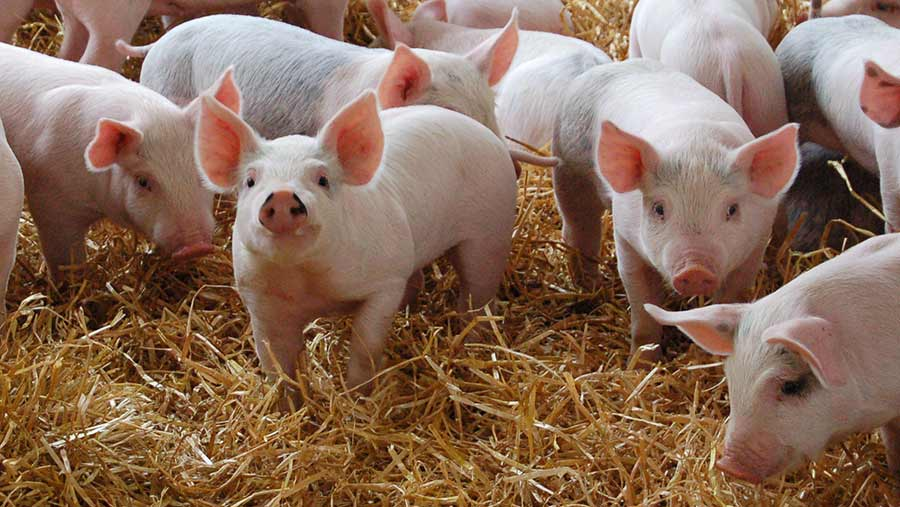

\fontsize{12}{22}
\selectfont

```{r setup, include=FALSE}
knitr::opts_chunk$set(echo = FALSE,message=F,warning=F)
```


```{r leitura_de_dados_e_pacotes, echo=FALSE,message=F,warning=F}
library(rgdal)
library(ggplot2)
library(ggmap)
library(stringr)
library(dplyr)
library(shadowtext)
library(GGally)
library(plotly)
library(kableExtra)


# Número de cabeças dos animais
pecuaria<-read.csv2("numerodecabeças.csv",header = T)[c(-1,-169),] #retirando a fonte "ibge"
pecuaria<-pecuaria%>%select(Municípios,Suínos)
names(pecuaria)[2]<-"num_cabeca"

estabelecimentos<-read.csv2("Número de estabelecimentos.csv",header=T)[c(-1,-169),]
estabelecimentos<-estabelecimentos%>%select(Municípios,Suínos)
names(estabelecimentos)[2]<- "num_propriedades"


# Meso e Microrregiões do RN
regioes<-read.csv2("meso_micro.csv",header=T)


# Criando o dataset de interesse 
p_completo<-right_join(data.frame(pecuaria,estabelecimentos)[,-3],
                       regioes,
                       by="Municípios")

# Mapa do RN
RN<-readOGR("rn_municipios", "24MUE250GC_SIR", encoding = "UTF-8",use_iconv = T,verbose = F)
names(RN)[1]<-"Municípios"
RN@data$id<-rownames(RN@data)


#Manipulando os dados para criar mapa

mapadata<-attr(RN,'data')
mapadata<-merge(mapadata,p_completo,by="Municípios")

attr(RN,'data')<-mapadata

#Criando o data frame

rn.pontos<-fortify(RN,by="id")
rn.df<-inner_join(rn.pontos,RN@data,by = "id")

#Baixando o mapa do RN
rnmap<-get_stamenmap(bbox = RN@bbox,
                     zoom=10)

```

\maketitle


\tableofcontents

\newpage

# Introdução

Segundo o Censo Agropecuário de 2017 do Instituto Brasileiro de Geografia e Estatística (IBGE),
no Rio Grande do Norte existem 63.452 estabelecimentos praticantes da agricultura, desses, 
54.742 praticam pecuária, e nesse grupo, 15.735 estabelecimentos fazem criação de suínos. Com 
base nesses dados, surgiu o interesse de saber qual a maior mesorregião produtora e quais os 
polos de produção desse animal.

# Coleta de dados

Para isso, foram coletados dados do Censo Agropecuário de 2017 do IBGE sobre o efetivo do 
rebanho de suínos de cada município e do número de estabelecimentos que criam essa espécie no 
estado do Rio Grande do Norte. Segundo o instituto:
"As informações sobre pessoal ocupado, estoques, **efetivos da pecuária**, lavouras permanentes
e silvicultura, entre outros dados estruturais, têm como referência o dia **30 de setembro de 
2017** [...]". Portanto, as análises aqui apresentadas referem-se ao dia 30/09/2017, levando-se em consideração que para cada estabelecimento o número de suínos pode diminuir ou aumentar devido aos abates e nascimentos de seus filhotes, não é possível captar a provável flutuação do efetivo do rebanho de suínos neste ano.




# Estatística descritiva

Para início de análise será realizada a visualização dos dados coletados, começando com o
histograma 1. No gráfico, há um comportamento assimétrico à direita onde a massa dos dados se 
concentra em torno da mediana: 416, além disso verifica-se que algumas barras se distanciam 
dessa massa que são as cidades com maior produção de suínos. A maior delas produzindo mais do 
que 4.500 cabeças. 

\vspace{1cm}
```{r Histograma_num_cab1}
p_completo%>%ggplot(aes(num_cabeca))+geom_histogram()+theme_bw()+
labs(title="Histograma 1: número de cabeças de suínos no RN",x="Número de cabeças de suínos",y="Frequência")
```


Para visualizar a distribuição da produção de cabeça de suínos de cada mesorregião do estado
é apresentado o histograma 2, nele a linha preta representa a mediana,
calculada a partir do efetivo do rebanho de todos os municípios. Verifica-se que todas as
mesorregiões têm uma massa de dados variando em torno da mediana geral levantando evidências que a produção mantenha um comportamento equivalente para os municípios do estado, salvo excessões presentes nas mesorregiões Central e Oeste Potiguar onde há uma quantidade considerável de municípios que atingem uma produção maior do que 1000 cabeças. 

\vspace{1cm}

```{r Histograma_num_cab12}
p_completo%>%ggplot(aes(num_cabeca,fill=MESORREGIAO))+geom_histogram()+theme_bw()+
labs(title="Histograma 2: número de cabeças de suínos por mesorregião potiguar",fill="Mesorregião",x="Número de cabeças de suínos",y="Frequência")+geom_vline(xintercept = 416,color="black",size=1)+facet_wrap(~MESORREGIAO)
#p_completo%>%group_by(MESORREGIAO)%>%summarise(Numero_municípios=length(MESORREGIAO))
```


# Compações Múltiplas

Surge então a seguinte dúvida: Será que as quatro mesorregiões apresentam mesmo um comportamento produtivo parecido? 

Para descobrir, aplica-se o teste da análise de variância (ANOVA) nos dados, que verifica se  
alguma mesorregião apresenta um comportamento produtivo mais alto (ou mais baixo) do que as outras 3 (três).

## ANOVA

Para esse teste são consideradas duas hipóteses: 

$H_0: \mu_1 = \mu_2 = \dots =\mu_4$ (isto é: A média de todas as mesorregiões são iguais.)

Vs

$H_1: \mu_i \neq \mu_j$, para algum $i \neq j$ (A média de alguma mesorregião é diferente da média de outra mesorregião.)

Aplicando o ANOVA e considerando um nível de significância $\alpha = 0,05%$ obtém-se um p-valor de $0,047 < \alpha$. Têm-se fortes evidências para rejeitar a hipótese nula $(H_0)$, ou seja, evidências que a produção de alguma mesorregião seja diferente de outra.

```{r anova}
aov<-aov(num_cabeca~MESORREGIAO,data = p_completo)
summary(aov)
```

\vspace{1cm}

Por haver tais evidências, aplica-se as comparações múltiplas nos dados, esse cálculo opera a 
subtração dos dados de uma mesorregião com os dados de outra e cria intervalos de confiança com
base no desvio padrão. O método utilizado foi o teste de diferenças significativamente honestas
de tukey. O resultado do teste indica que as evidências anteriores não são verdadeiras 
informando que a produção das mesorregiões têm comportamento parecido.

\vspace{1cm}

```{r Tukey}
tukey<-TukeyHSD(aov,ordered = T)$MESORREGIAO%>%data.frame()
tukey<-apply(tukey,2,function(x){round(x,digits = 2)})%>%as.data.frame()
kable(tukey,caption = "Teste de tukey",col.names = c("Diferença","L. Inferior","L. Superior","P-valor"),booktabs=T)%>%
  kable_styling(full_width = F)
``` 


\vspace{1cm}


# Melhor mesorregião produtora

Com base nos resultados anteriores, a decisão de qual a maior mesorregião produtora de suínos deve ser tomada com relação a média de produção de cabeças de cada mesorregião, uma vez que essa medida de tendência central leva em conta a influência dos municípios com produção fora do padrão do estado (outliers). Para isso, criou-se a tabela 1 das médias de produção de cada mesorregião, evidenciando que a Central potiguar lidera, com 37 municípios e um total de 3.567 estabelecimentos produtores, apresentando-se como a maior mesorregião produtora da espécie no RN.

\vspace{1cm}
```{r media_mesorregioes,}

kable(p_completo%>%group_by(MESORREGIAO)%>%summarise(
  Média=round(mean(num_cabeca,na.rm = T)),
  Número_de_Municípios=length(num_cabeca),
  Número_de_estabelecimentos=sum(num_propriedades,na.rm = T)
)%>%arrange(desc(Média)),caption = "Tabela 1: Média da produção em cada mesorregião",align=c("l","r","r","r"),col.names=c("Mesorregião ","Média ","Número de Municípios ","Número de estabelecimentos"),booktabs=T)%>%
  kable_styling(full_width = F)
```

\vspace{1cm}

Para apresentar os polos com maior produção de suínos no RN, a tabela 2 exibe uma listagem das 10 (dez) cidades com maior produção de suínos do RN em razão decrescente. Nela é destacado o nome do município, assim como o número de cabeças de suínos, número de propriedades, mesorregião e média de produção por propriedade (méd. estabelecimento).
Portanto, pode-se concluir que a cidade com maior produção de suínos da mesorregião Oeste Potiguar é Mossoró, sendo ela referência no estado pela sua produção agrícola e pela exportação de melão para o comércio internacional. Sendo seguida por Apodi, também do Oeste Potiguar, que assim como Mossoró é um polo de produção agrícola no estado. A terceira posição é ocupada por Caicó da Central Potiguar. Pode-se inferir claramente que o Oeste Potiguar apresenta as maiores produções do estado do RN, sendo possível levantar a hipótese de que nessa mesorregião o incentivo à agropecuária sobressai os demais estados. Um fenômeno interessante que pode ser observado a partir dos dados apresentados é o de que apesar da produção de suínos estar entre as dez maiores do estado, as cidades de Apodi, São Miguel, Lagoa Nova, possuem uma grande quantidade de estabelecimentos produtores, 579, 875, 802 respectivamente, apresentando um grande potencial produtor nesses municípios. Algumas conjecturas podem ser feitas, sendo a primeira a de que a maioria dos estabelecimentos destas cidades não criam o animal com um manejo técnico ou com uma perspectiva de lucro, diminuindo assim a sua produtividade. Outra suposição plausível é a de que estes estabelecimentos criam outras espécies de animais, como bois, e usam a oportunidade para criar o suíno devido seu fácil manejo.

\vspace{1cm}

```{r cidade mais produtiva}
top10<-(p_completo%>%select(1:4)%>%arrange(desc(num_cabeca)))[1:10,]
kable(data.frame(top10,média_por_estab.=round(top10[,2]/top10[,3])),caption="Tabela 2: top 10 do efetivo do rebanho no estado",col.names=c("Municípios","Núm. cabeças","Núm. propriedades","Mesorregião","Média por estabelecimento"),booktabs=T)%>%
  kable_styling(full_width = F)
```

\vspace{1cm}

# Visualização espacial

Com o intuito de localizar geograficamente os polos produtores de suíno no estado cria-se nas seguintes páginas três mapas. O mapa 1 apresenta o RN subdividido nas mesorregiões geográficas, de acordo com a atual divisão territorial do Brasil.

\vspace{1cm}
```{r mesorregioes_rn, echo=FALSE}
ggmap(rnmap)+geom_polygon(data=rn.df,aes(long,lat,group=Municípios,fill=MESORREGIAO),colour="black")+labs(title="Mapa 1: Mesorregiões do RN",x="Longitude",y="Latitude",fill="Mesorregiões")
```

O mapa 2 apresenta a produção de suínos em cada município.

```{r mapa_num_cabeça}
#pontos<-data.frame(long=c(-37.6,-37,-36),lat=c(-5.8,-6.2,-5.3),Municípios=c("Apodi","Caicó","Galinhos"))
ggmap(rnmap)+geom_polygon(data=rn.df,aes(long,lat,group=Municípios,fill=num_cabeca),colour="black")+scale_fill_gradient(low = "White",high = "darkred")+labs(title="Mapa 2: Produção de Suínos no RN no ano de 2017",subtitle="Número de cabeças produzidas",x="Longitude",y="Latitude",fill="Número de cabeças")

```

E o mapa 3 apresenta o número de estabelecimentos por município no estado do RN. 

```{r mapa_num_prop,warning=FALSE,message=F}
ggmap(rnmap)+geom_polygon(data=rn.df,aes(x=long,y=lat,group=Municípios,fill=num_propriedades),colour="black")+scale_fill_gradient(low="white",high = "darkred")+
  labs(title="Mapa 3: Número de estabelecimentos de suínos no RN em 2017",x="Longitude",y="Latitude",fill="Número de propriedades")
```


Considerando a legenda, observa-se que há uma tendência de maior produção nos municípios das mesorregiões Oeste e Central Potiguar (Ver mapa 1 e 2), além disso, pode-se observar que a maior quantidade de estabelecimentos criadores também concentram-se no Oeste e Central Potiguar. Pode-se perceber nos mapas que a produção das cidades tendem a ser altas quando essas são vizinhas de cidades que apresentam alta produção e tendem a ser baixas se forem vizinhas de cidades com baixa produção. 


# Considerações finais

Esse estudo teve o objetivo de encontrar os polos produtores de suínos, tanto a nível de 
mesorregião quanto de municípios utilizando os dados do IBGE. Dada as análises é possível 
dizer que esses objetivos foram alcançados, pois identificou-se qual a mesorregião com 
maior produção no estado, que foi a Central Potiguar e quais são as cidades com maior 
produção de suíno no estado.

Os métodos utilizados para alcançar os objetivos foram principalmente a estatística 
descritiva, a estatística inferencial e espacial. Para identificar qual a mesorregião com
maior produção utilizou-se a média de produção de suínos de cada mesorregião, indicando a
Central Potiguar como a maior produtora da espécie e utilizando-se da tabela 2 que foi 
possível ver que Mossoró tem a maior produção, seguido de Apodi, Caicó e assim por 
diante.

Foi interessante perceber que alguns municípios têm um grande potencial de produção que 
não estava sendo aproveitado durante o período de coleta do censo, pois existem alguns 
municípios com uma produção entre as 10 maiores do estado, mas com um número de 
estabelecimentos produtores imenso. Provavelmente esses estabelecimentos criam suínos  
apenas como complemento pois já devem ter um rebanho de boi ou outros animais, porém se a
criação de suíno for trabalhada e incentivada nesses municípios pela prefeitura por
exemplo, pode vir a aumentar exponencialmente a produção de suínos.

# Referências

Instituto Brasileiro de Geografia e Estatística, Censo Agropecuário 2017,https://www.ibge.gov.br/estatisticas/economicas/agricultura-e-pecuaria/21814-2017-censo-agropecuario.html?=&t=o-que-e,2017.

